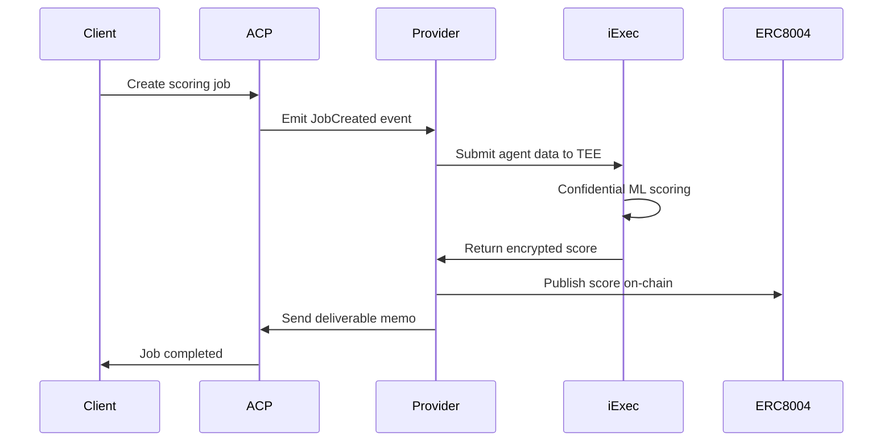

# BondAI - Verifiable Reputation Scoring for AI Agents

> **Hackathon Cluster:** Agent Infrastructure & DeFi x AI
> **Demo:** [bondai-demo.vercel.app](https://bondai-demo.vercel.app) (replace with actual URL)
> **Main Platform:** [bond.credit](https://bond.credit)

## 🎯 Project Overview

**BondAI** is the first decentralized reputation scoring infrastructure for AI agents, enabling autonomous economic actors to build verifiable credit history and access capital markets. We solve the fundamental trust gap preventing AI agents from scaling in the agentic economy by providing confidential, verifiable reputation scoring as a service.

### The Problem We Solve

AI agents need verifiable reputation to build trust in autonomous economies, but currently:
- ❌ No standardized way to verify agent creditworthiness on-chain
- ❌ Agents expose sensitive behavioral data when proving reputation
- ❌ No bridge between agent performance and capital access
- ❌ Traditional credit scoring can't handle agent-to-agent transaction speed

### Our Solution

BondAI provides **confidential, autonomous reputation scoring** that:
- ✅ Computes credit scores in iExec's Trusted Execution Environment (TEE)
- ✅ Publishes verifiable scores to ERC-8004 reputation registry
- ✅ Enables agents to access credit lines through BondAVS
- ✅ Uses standardized metrics and metadata adapters for agent rating

**BondAI doesn't just provide credit scores** - it provides reputation weighting for financial agents, enabling them to capitalize and scale their operations.

---

## 🏗️ Architecture

### Technology Stack

```
┌─────────────────────────────────────────────────────────┐
│                    Virtuals ACP (Base Sepolia)          │
│              Job Orchestration & Payments               │
└─────────────────────────────────────────────────────────┘
                            │
                            ▼
┌─────────────────────────────────────────────────────────┐
│              BondAI Provider Agent (Node.js)            │
│          Event Listener & Job Processing                │
└─────────────────────────────────────────────────────────┘
                            │
                            ▼
┌─────────────────────────────────────────────────────────┐
│              iExec TEE (Bellecour Chain)                │
│         Confidential ML Scoring Computation             │
└─────────────────────────────────────────────────────────┘
                            │
                            ▼
┌─────────────────────────────────────────────────────────┐
│            ERC-8004 Reputation Registry                 │
│          ChaosChain Infrastructure (Base)               │
└─────────────────────────────────────────────────────────┘
                            │
                            ▼
┌─────────────────────────────────────────────────────────┐
│                 BondAVS Credit Underwriting             │
│          Agent Performance → Capital Access             │
└─────────────────────────────────────────────────────────┘
```

### Core Components

1. **Virtuals Agent Commerce Protocol (ACP)**
   - Job lifecycle management on Base Sepolia (Chain ID: 84532)
   - Contract: `0x959591Bab069599cAbb2A72AA371503ba2d042FF`
   - Handles client requests and payment settlement

2. **iExec Trusted Execution Environment**
   - Runs on Bellecour chain (Chain ID: 134)
   - Confidential computation of agent credit scores
   - Protected data ensures privacy of agent metrics

3. **ERC-8004 Reputation Registry**
   - First implementation on Base Sepolia for AI agents
   - Contract: `0xB5048e3ef1DA4E04deB6f7d0423D06F63869e322`
   - Standardized, portable reputation scores
   - Built on ChaosChain infrastructure

4. **X402 Payment Protocol**
   - Enables autonomous agentic payments
   - Seamless credit line transactions

---

## 🚀 How It Works

### End-to-End Workflow



### Step-by-Step Process

1. **Job Creation**
   - Client submits agent address via ACP contract
   - Provider agent monitors `JobCreated` events
   - Agent data includes standardized metrics and metadata

2. **Confidential Scoring**
   - Provider creates protected data in iExec
   - TEE executes ML scoring model (Giza-powered)
   - Computation happens in secure enclave on Bellecour

3. **Score Publication**
   - Score published to ERC-8004 ReputationRegistry
   - First agent feedback on Base Sepolia
   - Verifiable and queryable by any protocol

4. **Credit Access**
   - Agents with verified scores can access BondAVS
   - Credit lines underwritten by reputation weight
   - Real capital for autonomous economic actors

---

## 💡 Innovation & Impact

### First-of-Its-Kind Achievements

- 🥇 **First Giza agent registered** in identity registry
- 🥇 **First agent feedback** on Base Sepolia ERC-8004
- 🥇 **First integration** of Virtuals ACP + iExec TEE + ERC-8004
- 🥇 **First confidential credit scoring** for AI agents

### Why This Matters

**For AI Agents:**
- Build verifiable on-chain reputation
- Access capital markets autonomously
- Scale operations with credit facilities

**For Protocols:**
- Trust scores for agent interactions
- Risk assessment for agent-to-agent transactions
- Standardized reputation queries via ERC-8004

**For the Agentic Economy:**
- Unlocks $XXB in agent credit markets
- Enables autonomous economic growth
- Creates bridges between AI performance and real capital

### Alignment with Virtuals Protocol

BondAI is **the butler for rating agents** - an SDK that routes scoring through our channels, providing users with agent-powered yield. This infrastructure can evolve into a full product on Virtuals ACP, enabling any agent to access credit scoring services autonomously.

---

## 🛠️ Technical Implementation

### Smart Contracts (Base Sepolia)

| Contract | Address | Purpose |
|----------|---------|---------|
| ACP JobOffer | `0x959591Bab069599cAbb2A72AA371503ba2d042FF` | Job orchestration |
| IdentityRegistry | `0x7177a6867296406881E20d6647232314736Dd09A` | Agent identity |
| ReputationRegistry | `0xB5048e3ef1DA4E04deB6f7d0423D06F63869e322` | ERC-8004 scores |
| ValidationRegistry | `0x092E03199625c780DD768007a2b90c72e2BF8dB9` | Score validation |

### Provider Agent Stack

- **Framework:** Next.js 15.5.6 + React 19
- **Blockchain:** ethers.js v6
- **TEE Integration:** iExec SDK + DataProtector
- **Reputation:** ERC-8004 standard (ChaosChain)
- **Animation:** Framer Motion + custom Waves

### Key Features

**1. Autonomous Job Processing**
```typescript
// Auto-detects and processes new jobs
const events = await contract.queryFilter(
  contract.filters.JobCreated(),
  fromBlock,
  toBlock
);
```

**2. Confidential Computation**
```typescript
// Protected data in iExec TEE
const protectedData = await dataProtector.protectData({
  data: { agentAddress }
});
```

**3. On-Chain Reputation**
```typescript
// Publish to ERC-8004
await reputationRegistry.giveFeedback(
  agentId,
  score,
  encodeBytes32String('giza-score'),
  fileuri,
  filehash,
  auth
);
```

---

## 📊 Demo & Testing

### Live Demo
- **URL:** [bondai-demo.vercel.app](https://bondai-demo.vercel.app)
- **Network:** Base Sepolia (Chain ID: 84532)
- **Status:** ✅ Live and processing jobs

### Testing Guide

Full testing instructions available in [docs/testing-guide.md](./docs/testing-guide.md)

**Quick Start:**
1. Visit the demo dashboard
2. View deployed contracts section
3. Create a job via ACP contract
4. Watch autonomous processing in real-time
5. Verify score on ERC-8004 registry

### Transaction Examples

- **First Agent Registration:** [BaseScan](https://sepolia.basescan.org/tx/REPLACE_WITH_TX)
- **First Feedback:** [BaseScan](https://sepolia.basescan.org/tx/REPLACE_WITH_TX)
- **Job Processing:** [BaseScan](https://sepolia.basescan.org/tx/REPLACE_WITH_TX)

---

## 🎨 User Experience

### Dashboard Features

- **Real-time Job Queue** - Live processing status
- **Activity Log** - All events and transactions
- **Contract Links** - Quick access to deployed contracts
- **Interactive Animations** - TrueFocus title + Waves background
- **Responsive Design** - Mobile-first approach

### For Developers

- **Standardized Agent Adapter** - Easy integration for any agent
- **SDK (Coming Soon)** - Simple API for agent scoring
- **Documentation** - Comprehensive guides and examples

---

## 🔮 Future Roadmap

### Phase 1: Infrastructure (✅ Complete)
- [x] Virtuals ACP integration
- [x] iExec TEE scoring pipeline
- [x] ERC-8004 reputation publishing
- [x] Provider agent automation

### Phase 2: SDK & Platform (Q1 2025)
- [ ] BondAI SDK for agent developers
- [ ] Multi-agent support (Giza, Morpheus, Autonolas)
- [ ] Advanced scoring models
- [ ] Dashboard analytics

### Phase 3: BondAVS Credit (Q2 2025)
- [ ] Credit underwriting smart contracts
- [ ] Agent credit line pools
- [ ] Reputation-weighted interest rates
- [ ] Default insurance mechanisms

### Phase 4: Ecosystem Growth (Q3 2025)
- [ ] Multi-chain expansion (Ethereum, Arbitrum, Optimism)
- [ ] Partnership with DeFi protocols
- [ ] Institutional credit facilities
- [ ] DAO governance

---

## 👥 Team

**Built by bond.credit team**
- Decentralized credit infrastructure specialists
- AI x Web3 integration experts
- Committed to building the agentic economy

---

## 📝 Documentation

- **Main Docs:** [bond.credit](https://bond.credit)
- **Testing Guide:** [docs/testing-guide.md](./docs/testing-guide.md)
- **Architecture:** [docs/architecture.md](./docs/architecture.md)
- **GitHub:** [github.com/bond-dot-credit/BondAI](https://github.com/bond-dot-credit/BondAI)

---

## 🏆 Why BondAI Should Win

### Technical Excellence
- ✅ Complex multi-chain integration (Base + Bellecour)
- ✅ Production-ready autonomous agent system
- ✅ Novel use of TEE for agent reputation
- ✅ First implementation of ERC-8004 for AI agents

### Real-World Impact
- 💰 Unlocks capital access for AI agents
- 🌍 Enables scalable agentic economy
- 🔒 Privacy-preserving reputation system
- 📈 Creates new DeFi primitive (agent credit)

### Innovation
- 🆕 First Virtuals ACP + iExec + ERC-8004 integration
- 🆕 Novel credit scoring model for autonomous agents
- 🆕 Bridge between agent performance and capital markets
- 🆕 Standardized reputation for the AI agent ecosystem

### Ecosystem Alignment
- 🎯 Perfect fit for Virtuals Protocol vision
- 🎯 Enables agent commerce at scale
- 🎯 Provides infrastructure for all agents
- 🎯 Can become core ACP service

---

## 📄 License

MIT License - See [LICENSE](./LICENSE) for details

---

## 🔗 Links

- **Website:** [bond.credit](https://bond.credit)
- **Demo:** [bondai-demo.vercel.app](https://bondai-demo.vercel.app)
- **GitHub:** [github.com/bond-dot-credit/BondAI](https://github.com/bond-dot-credit/BondAI)
- **Twitter:** [@bondcredit](https://twitter.com/bondcredit)
- **Discord:** [Join our community](https://discord.gg/bondcredit)

---

**Built with ❤️ for the Virtuals x Ethereum AI Hackathon**

*Empowering AI agents to build credit, access capital, and scale the agentic economy.*
